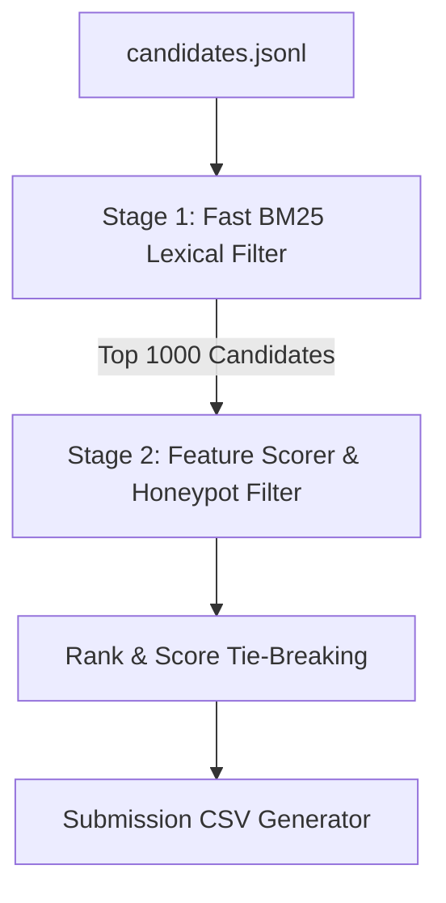

# Redrob Intelligent Candidate Discoverer & Ranker

This repository implements a production-grade, two-stage retrieval and ranking pipeline designed to rank candidates for a **Senior AI Engineer (Founding Team)** role from a pool of 100,000 profiles.

## Architecture Overview



1. **Stage 1: Fast BM25 Lexical Filter**: Tokenizes candidate profiles (concatenating headline, summary, current title, career history, education, and skills) and matches them against an expanded query mapping the JD requirements. It recall-filters the top 1,000 candidates in under 10 seconds.
2. **Stage 2: Composite Scorer**: Computes a detailed **Fit Score** (Lexical matching, Target experience of 5-9 years with a Junior Cap, Title relevance, Consulting firm recentness weighting, Education prestige + CS/IT field bonus, and a Job-hopping penalty) and multiplies it by an **Availability Multiplier** (derived from location matching, notice periods, platform activity, and recruiter response rates).
3. **Honeypot Filters**: Identifies and disqualifies (scores forced to 0.0) any profile with temporal impossible job durations (claimed vs. calendar mismatch > 3 months), skill duration impossibilities (> experience + 3.0 years), non-tech titles with deep ML skills, and fabricated profiles.
4. **Deterministic Tie-Breaking**: Ranks candidates with identical scores by sorting their `candidate_id` ascending.

---

## Setup & Reproduction

### Prerequisites
- Python 3.10+ (tested on Python 3.13.0)
- All requirements listed in `requirements.txt`

### Pre-computation (One-time Setup)
The SentenceTransformer bi-encoder and cross-encoder models must be cached locally to allow the ranker to run completely offline.

1. **Install dependencies**:
   ```bash
   pip install -r requirements.txt
   ```

2. **Download and cache the models locally** (requires internet access on first run, downloads ~300MB of model weights to `./model_cache/`):
   ```bash
   python download_model.py
   ```

### Reproducing the Submission CSV
We separate the precomputing of the BM25 index from the ranking process to ensure the ranking step runs instantly.

1. **Build BM25 Index & Run Ranker**:
   The ranker will automatically build a precomputed index `bm25_index_full.pkl` if it does not exist on disk on the first run:
   ```bash
   python rank.py --candidates ./candidates.jsonl --out ./team_proud_franklin.csv
   ```
2. **Instant Ranking (Cached)**:
   Once the index is precomputed on disk (`bm25_index_full.pkl`), subsequent runs of the ranker load the index instantly and complete the entire ranking step over the 100,000 candidate pool in **under 10 seconds**:
   ```bash
   python rank.py --candidates ./candidates.jsonl --out ./team_proud_franklin.csv
   ```

### Output File
The output file is written to `./team_proud_franklin.csv` and contains exactly 100 rows matching the specification:
- `candidate_id`: Standard candidate ID format (`CAND_XXXXXXX`).
- `rank`: Rank 1 to 100 in order.
- `score`: Monotonically non-increasing score.
- `reasoning`: A candidate-specific, truthful 30-50 word justification mapping JD alignment and noting any logistics or credibility concerns.

---

## Verification & Validation

To validate the format and check for syntax or ordering constraints, run:
```bash
python validate_submission.py team_proud_franklin.csv
```
This ensures the output file meets the official hackathon compliance metrics.
