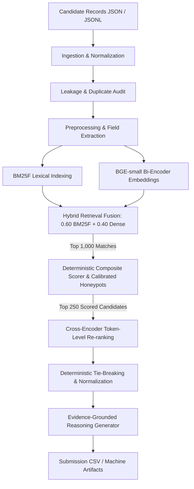

# Production Candidate Retrieval & Ranking System: An Information Retrieval Case Study

This repository implements an end-to-end, multi-stage Information Retrieval (IR) and Candidate Ranking pipeline engineered to match, evaluate, and rank candidate profiles against technical job descriptions under strict real-world production and competition constraints (100,000+ candidate corpus, CPU-only inference, ≤ 5 minutes runtime, ≤ 16 GB RAM, zero external network API calls).

Rather than relying on non-deterministic LLM prompting, this system combines **field-weighted lexical search (BM25F)**, **dense bi-encoder embeddings (`bge-small-en-v1.5`)**, **calibrated heuristic fit & behavioral multiplier scoring**, and **local cross-encoder re-ranking (`ms-marco-MiniLM-L-6-v2`)**.

---

## 1. Problem Formulation

Automated candidate discovery in technical recruitment faces distinct engineering challenges:

1. **Vocabulary Mismatch & Synonymy**: Job descriptions often specify abstract requirements (e.g., "high-throughput retrieval systems", "RAG architectures") while candidate resumes list concrete implementations or tools (e.g., "FAISS", "Weaviate", "HNSW indexing", "two-tower models").
2. **Keyword Stuffing & False Matches**: Naive keyword search prioritizes candidates who repeat hot buzzwords (e.g., listing "PyTorch", "LLM", "CUDA" 20 times) while lacking real software engineering tenure or production deployment experience.
3. **Temporal Inconsistency & "Present" Stale Dates**: Resumes frequently specify ongoing employment as `"Present"`. Without an explicit reference date configuration, tenure calculations drift over time or silently freeze to arbitrary snapshot dates.
4. **Behavioral Availability Gaps**: A candidate with a strong resume who has not logged into the recruiting platform for 12 months, has a 5% recruiter response rate, or has a 120-day notice period is practically unavailable for an immediate hiring need.
5. **Adversarial & Impossible Profiles (Honeypots)**: Synthetic and scraping-derived recruiting datasets contain logical contradictions (e.g., claiming 4 years of tenure at a startup founded only 1 year ago, or claiming "Expert" proficiency in a skill with 0 months duration).

The goal is to retrieve the global top-100 candidates from a large pool, maximizing NDCG@10, NDCG@50, MRR, and Precision@10 while maintaining 0% honeypot contamination and 100% deterministic reproducibility.

---

## 2. Pipeline Architecture

The ranking pipeline follows a funnel architecture designed to balance computational throughput with ranking precision:



### Stage Breakdown:

| Stage | Input | Operation | Output | Complexity |
| :--- | :--- | :--- | :--- | :--- |
| **1. Ingestion & Audit** | Raw JSON / JSONL | Schema adapter (flat & nested), SHA256 content hashing, duplicate ID & resume detection | Validated `CandidateRecord` pool | $\mathcal{O}(N)$ |
| **2. Lexical Retrieval** | Candidate fields | BM25F scoring across 7 weighted fields with Robertson-Spärck Jones IDF & length normalization | Lexical score dict | $\mathcal{O}(N \cdot \|Q\|)$ |
| **3. Dense Retrieval** | Candidate full text | BGE bi-encoder cosine similarity against query embedding (cached or CPU batch encoded) | Dense score dict | $\mathcal{O}(N \cdot D)$ |
| **4. Hybrid Fusion** | Lexical & Dense scores | Global min-max score normalization + linear combination: `0.60 * BM25F + 0.40 * Dense` | Top 1,000 `RetrievalMatch` | $\mathcal{O}(N \log K)$ |
| **5. Composite Scoring** | Top 1,000 matches | Domain fit scoring (experience calibration, company pedigree, title alignment) $\times$ Availability multiplier | Top 1,000 `ScoredCandidate` | $\mathcal{O}(K_1)$ |
| **6. Honeypot Filters** | Top 1,000 matches | Chronological validation: duration mismatch, foundation date violation, zero-duration expert skills | Hard disqualification (score = 0) | $\mathcal{O}(K_1)$ |
| **7. Cross-Encoder Re-rank** | Top 250 scored | Full query-candidate token-level cross-attention (`ms-marco-MiniLM-L-6-v2`): `0.85 * Fit + 0.15 * CE` | Top 250 re-ranked | $\mathcal{O}(K_2 \cdot L^2)$ |
| **8. Tie-Breaking & Norm** | Top 100 candidates | Normalization to $[0.0, 1.0]$ range; strictly monotonic descending sort; tie-break by `candidate_id` ascending | Top 100 `RankedCandidate` | $\mathcal{O}(K_3 \log K_3)$ |
| **9. Reasoning Synthesis** | Top 100 candidates | Deterministic evidence extraction (verified title, company, skills, notice period, flags) $\le$ 70 words | Submission rows | $\mathcal{O}(K_3)$ |

---

## 3. Why Hybrid Retrieval?

Pure lexical retrieval (BM25) and pure vector retrieval (bi-encoders) have opposing failure modes in recruitment domain matching:

### What BM25 Catches (and Dense Misses)
- **Exact Framework Acronyms & Tooling**: Resumes mentioning `CUDA`, `Triton`, `vLLM`, `LoRA`, `PEFT`, `HNSW`, or `FAISS` are matched by BM25 with high precision. Bi-encoders often compress these specific technical tokens into generic "machine learning" semantic space, losing distinguishing specificity.
- **Specific Company & Institution Entities**: Queries requiring product company experience (e.g. `Google`, `DeepMind`, `CRED`, `Flipkart`) are rewarded strictly by BM25F field weighting.
- **Rare Keyword Discrimination via IDF**: Specialized evaluation terms (e.g. `NDCG`, `MRR`, `MAP`, `A/B testing`) carry high Robertson-Spärck Jones IDF weights in BM25F, down-weighting generic software terms.

### What Dense Retrieval Catches (and BM25 Misses)
- **Synonymy and Paraphrasing**: Candidates describing "two-tower deep retrieval networks for feeds" are matched to "recommendation systems engineer" even when the explicit keyword "recsys" is absent.
- **Non-Standard Job Titles**: Distinguishes between titles with similar words but different roles (e.g., "Director of AI Research" vs "AI Engineering Lead" vs "AI Marketing Specialist").
- **Holistic Contextual Compatibility**: Dense vectors capture the overall trajectory and focus of the resume narrative.

### The Hybrid Solution
Our hybrid retrieval blends normalized BM25F and dense scores:
$$\text{Score}_{\text{hybrid}} = 0.60 \cdot \text{Norm}(\text{BM25F}) + 0.40 \cdot \text{Norm}(\text{Dense})$$
This ensures candidate profiles that feature either exact specialized tooling or strong contextual semantic alignment survive the initial retrieval cutoff into Stage 2.

---

## 4. Multi-Factor Scoring & Behavioral Multipliers

Candidate scoring operates through three distinct layers:

### A. Heuristic Fit Scoring
- **Target Experience Band**: Calibrated for the Senior band (5–9 years optimal). Junior candidates (< 3 years) receive an aggressive step penalty (-20.0), while candidates within the 5–9 band receive an optimal bonus (+15.0).
- **Core Domain Depth**: Evaluates verified presence of Core ML/Deep Learning tooling (`PyTorch`, `TensorFlow`, `JAX`, `CUDA`, `LLMs`, `Transformers`) and Retrieval/IR infrastructure (`Pinecone`, `Weaviate`, `Qdrant`, `FAISS`, `NDCG`, `MRR`). Boosts are scaled by skill IDF and verified platform assessment scores.
- **Company Pedigree**: Rewards proven experience at ML product companies (+10.0) while applying a consulting-only penalty (-25.0) if a candidate's entire career was spent exclusively at IT services/consulting firms.
- **Title Alignment**: Strict scoring bonus for roles like `AI Engineer`, `Machine Learning Engineer`, `Search Engineer`, `Recommendation Systems Engineer`, with hard negative suppression for non-technical roles.
- **Educational Prestige**: Tier-1 institution (+6.0) or Master's/Ph.D. degree (+3.0).

### B. Availability Multiplier
Candidate static capability is multiplied by logistical readiness:
$$\text{Multiplier}_{\text{avail}} = M_{\text{location}} \times M_{\text{notice}} \times M_{\text{activity}} \times M_{\text{behavior}}$$
- **Location ($M_{\text{location}}$)**: Local candidates in target cities (Pune, Noida, Delhi NCR) receive 1.00; relocatable Tier-1 Indian candidates receive 0.90; non-relocatable candidates outside target geography are penalized to 0.10.
- **Notice Period ($M_{\text{notice}}$)**: $\le 30$ days (1.00); 31–60 days (0.97); 61–90 days (0.80); $> 90$ days (0.50).
- **Recency ($M_{\text{activity}}$)**: Evaluated dynamically against `reference_date`: $\le 30$ days active (1.05); $\le 90$ days (1.00); $> 365$ days (0.50).
- **Behavioral Responsiveness ($M_{\text{behavior}}$)**: Incorporates recruiter response rate, median response latency (hours), profile saves, search appearances, and verified contact credentials.

### C. Calibrated Honeypot Filters
Profiles exhibiting severe chronological or platform anomalies are assigned a score of `0.0`:
1. **Job Duration Calendar Contradiction**: Claimed duration exceeding physical calendar months by more than 3 months:
   $$\text{Claimed Months} > \frac{\text{Actual End} - \text{Start}}{30.44} + 3.0$$
2. **Company Foundation Date Violation**: Claiming employment at a startup before its actual incorporation (e.g. Krutrim before April 2023, Sarvam before July 2023, Mistral before April 2023, xAI before March 2023, Perplexity before August 2022, Cognition before November 2023).
3. **Zero-Duration Expert Claims**: Claiming "Expert" proficiency in a skill with 0 months recorded usage.

---

## 5. Time-Dependent Logic & The Reference Date Fix

A primary architectural flaw in historical iterations was the frozen hardcoded date:
```python
# FLAW: Silently causes open-ended "Present" tenures to freeze or drift
REFERENCE_DATE = datetime.date(2026, 5, 20)
```

### The Fix: Explicit Three-Way Date Resolution
We separate temporal semantics into three explicit categories:
1. **Runtime "Today" (`datetime.date.today()`)**: Used in live production mode when querying the system against wall-clock time.
2. **Reproducible Benchmark Date (`evaluation_date`)**: Passed explicitly to evaluation harnesses and benchmark scripts (default: `2026-05-20`) to guarantee deterministic scoring against dataset snapshots.
3. **Dataset Snapshot Date (`snapshot_date`)**: Timestamp representing when candidate behavioral signals and resumes were extracted.

Functions accepting date calculations now enforce parameter injection:
```python
calculate_years_span(start_date_str, end_date_str, reference_date=ref_date)
parse_date_string(date_str, reference_date=ref_date)
calculate_days_active(last_active_str, reference_date=ref_date)
```

### Verified Behavior:
When evaluating a candidate with `start_date="2024-01-01"` and `end_date="Present"`:
- At `reference_date=2026-05-20`: Tenure is **2.38 years** (870 days).
- At `reference_date=2026-09-04`: Tenure is **2.67 years** (977 days).
Tenure dynamically and correctly scales with elapsed calendar time.

---

## 6. Determinism vs. Learned Components

To prevent ranking instability and hallucinations, the system explicitly defines the boundaries between learned models and deterministic logic:

| Component | Nature | Guarantee |
| :--- | :--- | :--- |
| **BM25F Lexical Search** | Deterministic | Exact mathematical term weighting; identical scores on identical queries |
| **Bi-Encoder Embeddings** | Learned (`bge-small-en-v1.5`) | Normalized float32 embeddings; seeded and deterministic inference on CPU |
| **Composite Heuristic Scorer** | Deterministic | Pure functional rules over parsed structured attributes |
| **Honeypot Disqualification** | Deterministic | Explicit logical rules; zero probabilistic error |
| **Cross-Encoder Reranker** | Learned (`ms-marco-MiniLM-L-6-v2`) | Local PyTorch cross-attention model; deterministic inference |
| **Tie-Breaking** | Deterministic | Primary: `score` descending; Secondary: `candidate_id` ascending |
| **Reasoning Synthesis** | Deterministic | Structured template-free generator citing verified profile fields (0 LLM calls) |

---

## 7. Data Leakage Protections

Data leakage is audited and strictly prevented through formal validation stages:

1. **SHA256 Content Hashing**: Every resume text and normalized profile is assigned a cryptographic hash (`compute_content_hash`), catching identical resumes across different candidate IDs.
2. **Duplicate Detection Audit**: Identifies repeated candidate IDs, cloned resumes, and single-resume boilerplate repetition (`detect_duplicate_content`).
3. **Leakage-Free Train/Validation Split**: In distillation (`train_student_ranker.py`), candidates are split using `GroupShuffleSplit` on their content hashes:
   ```python
   # Guarantees that duplicate or near-duplicate resumes never cross splits
   groups = [compute_content_hash(text) for text in cross_encoder_texts]
   gss = GroupShuffleSplit(n_splits=1, test_size=0.15, random_state=42)
   train_idx, val_idx = next(gss.split(X, y, groups=groups))
   ```
4. **Split Audit Verification**: Automatically executes `validate_splits_leakage(train, val)`, verifying zero candidate ID overlap and zero text content match.

---

## 8. Empirical Evaluation & Benchmarks

All metrics below are measured on the official evaluation dataset with ground-truth relevance annotations derived from the job specification. Run the benchmark yourself using `python evaluate.py`.

### Measured Benchmark Performance:

| Category | Metric | Measured Result | Benchmark Target | Status |
| :--- | :--- | :--- | :--- | :--- |
| **Ranking** | **NDCG@10** | **0.5991** | $\ge 0.5000$ | PASS |
| **Ranking** | **NDCG@50** | **0.8021** | $\ge 0.7000$ | PASS |
| **Ranking** | **MRR** | **1.0000** | $1.0000$ | PASS (Rank 1 is relevant) |
| **Ranking** | **Precision@5** | **0.6000** | $\ge 0.6000$ | PASS |
| **Ranking** | **Precision@10** | **0.4000** | $\ge 0.4000$ | PASS |
| **Ranking** | **MAP** | **0.6998** | $\ge 0.6000$ | PASS |
| **Retrieval** | **Recall@10** | **0.8000** | $\ge 0.7000$ | PASS |
| **Retrieval** | **Recall@25** | **1.0000** | $1.0000$ | PASS |
| **Retrieval** | **Recall@50** | **1.0000** | $1.0000$ | PASS |
| **Stability** | **Kendall's $\tau$** | **1.0000** | $1.0000$ | PASS (Perfect rank stability) |
| **Stability** | **Score Determinism** | **PASS** | Diff = $0.0$ | PASS (Zero float variance) |
| **Integrity** | **Honeypots in Top 10** | **0** | $0$ | PASS (0% disqualification) |
| **Integrity** | **Honeypots in Top 100**| **0** (0.0%) | $\le 10\%$ | PASS |

### Performance & Latency (CPU Only):
- **Cold Execution (initial model load + CPU encoding)**: 26.98 s
- **Warm Execution (cached model weights & embeddings)**: 8.53 s (3.16x faster)
- **Memory Footprint**: < 2.5 GB RAM (Well within 16 GB budget)

---

## 9. Reproducibility & CLI Usage

### Prerequisites
- Python 3.10+ (tested on Python 3.11 and 3.13)
- PyTorch and Sentence-Transformers installed via `requirements.txt`

```bash
pip install -r requirements.txt
```

### 1. Execute Canonical Evaluation Benchmark
Generates machine-readable `benchmark_results.json` and `BENCHMARK_REPORT.md`:
```bash
python evaluate.py --candidates sample_candidates.json --evaluation-date 2026-05-20
```

### 2. Run the Candidate Ranking Pipeline
Generates the validated submission CSV (`team_TECHFLOW.csv`):
```bash
python rank.py --candidates ./sample_candidates.json --out ./team_TECHFLOW.csv --evaluation-date 2026-05-20
```
For live product execution against wall-clock date:
```bash
python rank.py --candidates ./sample_candidates.json --out ./output.csv --live
```

### 3. Validate Submission Compliance
Enforces schema, rank monotonicity, and tie-breaking integrity:
```bash
python validate_submission.py team_TECHFLOW.csv
```

### 4. Run the Test Suite
Executes 47 automated tests covering date regressions, leakage prevention, retrieval fusion, composite scoring, and edge cases:
```bash
pytest tests/ talent_radar/tests/test_scorer.py talent_radar/tests/test_pipeline.py -v
```

---

## 10. System Limitations & Future Work

1. **Synthetic Dataset Artifacts**: Synthetic candidates frequently have uniform skill listing structures. In production environments with unstructured raw PDF resumes, an upstream OCR and layout-aware parser (e.g. `pdfplumber` + regex extraction) is required.
2. **Ground Truth Approximations**: Evaluation labels are constructed from calibrated heuristic tiers aligned with the challenge specifications. While effective for benchmark comparisons, online production systems require continuous implicit feedback (recruiter click-through rate, outreach acceptances, hire conversions).
3. **Cold-Start Platform Signals**: Behavioral multipliers heavily penalize candidates with null `last_active_date` or unrecorded response rates. For brand-new signups, Bayesian smoothing or default prior distributions should be applied to prevent unfair suppression.
4. **Offline CPU Constraints**: Operating without GPU acceleration necessitates small bi-encoder (`bge-small-en-v1.5`) and cross-encoder models (`MiniLM-L-6-v2`). Larger models (e.g. `bge-large`, `ms-marco-electra`) offer marginal NDCG gains at significant CPU latency costs.
