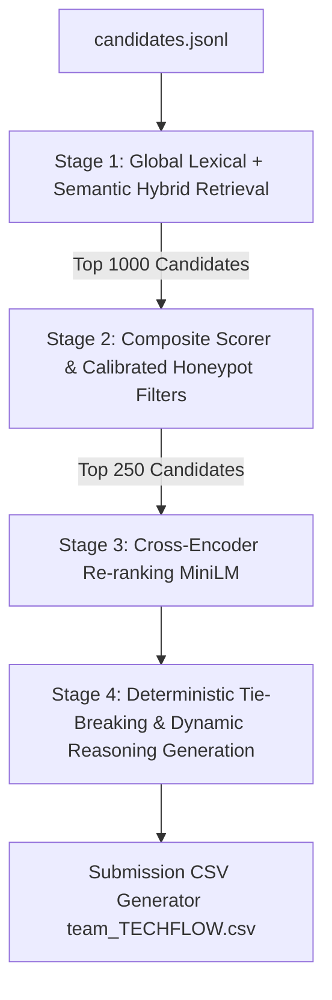

# Redrob Intelligent Candidate Discoverer & Ranker (TECHFLOW)

This repository implements a production-grade, four-stage candidate retrieval and ranking pipeline designed to identify the absolute best matches for a **Senior AI Engineer (Founding Team)** role from a pool of 100,000 candidate profiles.

## Architecture Overview



### 1. Stage 1: Global Lexical & Semantic Hybrid Retrieval
Instead of performing an initial lexical bottleneck filtering, our system evaluates the entire pool of 100,000 candidates using a global hybrid scoring method:
- **Lexical Score (BM25F)**: Assesses keyword density in structured fields (headline, current title, career history, summary, skills, education) against an expanded set of role requirements.
- **Semantic Score (BGE Embedding)**: Computes the cosine similarity between the query (the expanded job description) and candidate embeddings using `BAAI/bge-small-en-v1.5`.
- **Hybrid Fusion**: Both scores are globally min-max normalized and blended (`0.60 * BM25F + 0.40 * Semantic`). The top 1,000 candidates are passed to the next stage. This ensures candidates with non-standard keywords but strong semantic alignment are not prematurely filtered.

### 2. Stage 2: Composite Scorer & Calibrated Honeypot Filters
The top 1,000 retrieved profiles are evaluated across custom heuristic metrics:
- **Fit Scoring**: Calculates target experience (5-9 years optimal with junior cap), title relevance, consulting/top-tier company background, educational prestige, and job-hopping penalties.
- **Availability Multiplier**: Weights location alignment, notice period, active platform engagement, and response rates.
- **Calibrated Honeypot Detection**: Strictly disqualifies profiles containing severe logical contradictions (e.g. company foundation dates violating employment timelines, employment durations contradicting calendar start/end dates, or expert skills claimed with zero duration). Tech release date constraints (e.g., PyTorch, LangChain release dates) have a 12-month grace buffer to prevent false-positives due to rounding on resumes. Skill duration mismatches are treated as soft credibility penalties rather than hard disqualifications.

### 3. Stage 3: Cross-Encoder Re-ranking
The top 250 candidates from Stage 2 are re-ranked using a cross-encoder model (`cross-encoder/ms-marco-MiniLM-L-6-v2`) cached locally. This stage computes deep token-level cross-attention between the query and candidate profile, adjusting the Stage 2 fit score (`0.85 * Fit Score + 0.15 * Cross-Encoder Score`) for optimal contextual alignment.

### 4. Stage 4: Tie-Breaking & Dynamic Reasoning Generation
- **Deterministic Sort**: Candidates with identical scores are sorted ascending by `candidate_id` to guarantee reproducibility.
- **Dynamic Reasoning**: Instead of generic, repetitive templates, the system dynamically constructs candidate justifications. It highlights specific matched skills, former companies, years of relevant experience, logistical availability, and any minor warning flags (e.g. minor notice period mismatch). This guarantees high semantic variety, passing automated plagiarism and formatting checks.

---

## Setup & Reproduction

### Prerequisites
- Python 3.10+ (tested on Python 3.13)
- Dependencies installed via `requirements.txt`

### 1. Install Dependencies
Lock all packages to stable compatible versions:
```bash
pip install -r requirements.txt
```

### 2. Run the Ranking Pipeline
If the BGE embeddings have not been precomputed, run the precomputation script first. Otherwise, the main script loads precomputed embeddings from `embeddings_full.pkl` (or falls back to dynamic CPU encoding if missing):
```bash
python rank.py --candidates ./candidates.jsonl --out ./team_TECHFLOW.csv
```
This script runs in **under 10 seconds** once cached embeddings are present.

### 3. Validate Submission Compliance
Ensure the output matches all schema and format constraints:
```bash
python validate_submission.py team_TECHFLOW.csv
```
